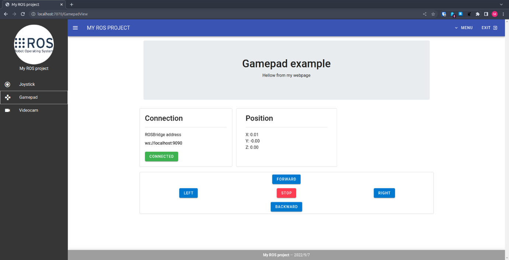
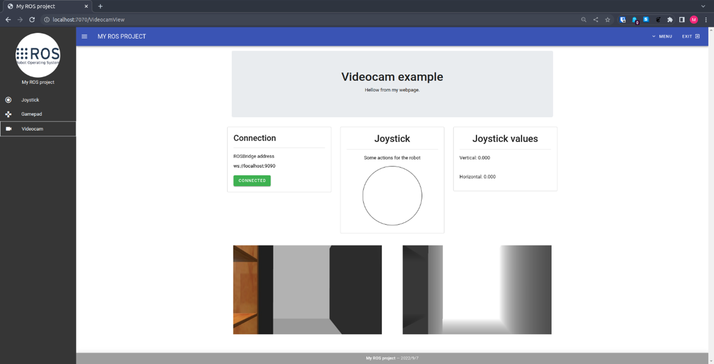

# My-ROS-Project

## Index
1. Overview
2. Design
    - Web interface
    - Arquitecture
3. Dependencies
4. Installation
    - Install Ubuntu 20.04.5 LTS (Focal Fossa)
    - ROS 2 Foxy installation
    - ROS 2 Foxy create a workspace
    - Install nodes
5. Usage
    - Execute nodes
    - Run web page

## 1. Overview
This is a Web page develop with HTML, CSS, JavaScript, Vue and ROS2 Foxy.
The website has the following options:
- Joystick: the user can move the robot with a web joystick.
- Gamepad: the user can move the robot with a web gamepad.
- Webcamera: the user can see the robot's camera on the web page.

This project has been tested under ROS 2 Foxy and Ubuntu 20.04.4 LTS (Focal Fossa).
This page is compatible with RB1 and Tiago robot.

Author: Manuel Fernández Miguélez, mfernm30@gmail.com

## 2. Design
### Web interface


### Arquitecture


## 3. Dependencies
- Ubuntu 20.04.5 LTS (Focal Fossa): [installation](https://releases.ubuntu.com/focal/).
- Robotic Operating System (ROS 2 Foxy): [installation](https://docs.ros.org/en/foxy/Installation/Ubuntu-Install-Debians.html).
- RB1 simulator for ROS 2 Foxy: [repository](https://github.com/mgonzs13/ros2_rb1.git).
- RobotWebTools Web Video Server for ROS 2 Foxy: [repository](https://github.com/RobotWebTools/web_video_server/tree/ros2).
- RobotWebTools Rosbridge Server for ROS2 Foxy: [repository](https://github.com/RobotWebTools/rosbridge_suite)
- Node.js 16.17.0: [installation](https://github.com/nodesource/distributions/blob/master/README.md)

## 4. Installation
### ROS 2 Foxy installation
#### Set locale
Make sure you have a locale which supports UTF-8.
```
locale  # check for UTF-8

sudo apt update && sudo apt install locales
sudo locale-gen en_US en_US.UTF-8
sudo update-locale LC_ALL=en_US.UTF-8 LANG=en_US.UTF-8
export LANG=en_US.UTF-8

locale  # verify settings
```

#### Setup Sources
Make sure that the Ubuntu Universe repository is enabled.
```
apt-cache policy | grep universe
```
This should output a line like the one below.
```
500 http://us.archive.ubuntu.com/ubuntu focal/universe amd64 Packages
    release v=20.04,o=Ubuntu,a=focal,n=focal,l=Ubuntu,c=universe,b=amd64
```
If you don’t see an output line like the one above, then enable the Universe repository with these instructions.
```
sudo apt install software-properties-common
sudo add-apt-repository universe
```
Now add the ROS 2 apt repository to your system.
```
sudo apt update && sudo apt install curl gnupg2 lsb-release
sudo curl -sSL https://raw.githubusercontent.com/ros/rosdistro/master/ros.key  -o /usr/share/keyrings/ros-archive-keyring.gpg
```
Then add the repository to your sources list.
```
echo "deb [arch=$(dpkg --print-architecture) signed-by=/usr/share/keyrings/ros-archive-keyring.gpg] http://packages.ros.org/ros2/ubuntu $(source /etc/os-release && echo $UBUNTU_CODENAME) main" | sudo tee /etc/apt/sources.list.d/ros2.list > /dev/null
```

### Install ROS 2 packages
Update your apt repositories, then is recommended to work on an updated Ubuntu system.
```
sudo apt update
sudo apt upgrade
```
Desktop Install (Recommended): ROS, RViz, demos, tutorials.
```
sudo apt install ros-foxy-desktop
```
ROS-Base Install (Bare Bones): Communication libraries, message packages, command line tools. No GUI tools.
```
sudo apt install ros-foxy-ros-base
```

#### Enviroment setup
Source the setup script
```
# Replace ".bash" with your shell if you're not using bash
# Possible values are: setup.bash, setup.sh, setup.zsh
source /opt/ros/foxy/setup.bash
```

### ROS 2 Foxy create a workspace
Create a new directory for every new workspace.
```
mkdir -p ~/ros2_ws/src
cd ~/ros2_ws/src
```
### Install nodes
Clone RB1 simulator repository
```
git clone https://github.com/mgonzs13/ros2_rb1.git
```
Clone Web Video Server repository
```
git clone https://github.com/RobotWebTools/web_video_server.git
```
Install rosdep
```
sudo apt install python3-rosdep2
rosdep update
```
Resolve dependencies
```
rosdep install --from-paths src --ignore-src -r -y
```
Install colcon
```
sudo apt install python3-colcon-common-extensions
```
Build repositories with colcon
```
colcon build
```
Install rosbridge
```
sudo apt install ros-foxy-rosbridge-server
```
## 5. Usage
### Execute nodes
At the public/Scripts directory inside this project, there are 3 scripts.
Run them in the next order:

1. Run RB1 simulator node for ROS 2 Foxy (1robot_script.sh).
2. Run Rosbridge Server node for ROS 2 Foxy (2rosbridge_script.sh).
3. Run Web Video Server for ROS 2 Foxy (3web_video_server_script.sh).

¡Important! The script will not work until you change the path of your ROS 2 workspace.
Go into each Script and change the path at cd line.

To execute them use the next commands:
```
./1robot_script.sh
./2rosbridge_script.sh
./3web_video_server_script.sh
```
### Run web page
Install Node.js
```
curl -fsSL https://deb.nodesource.com/setup_16.x | sudo -E bash - &&\
sudo apt-get install -y nodejs
```
Install npm
```
sudo npm install -g npm@latest
```
Install web page dependencies
```
npm install
```
Run web page in development mode
```
npm run serve
```